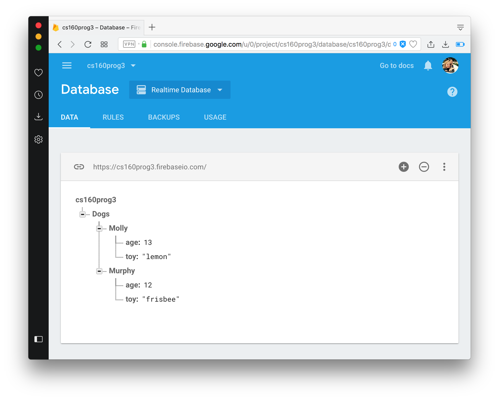
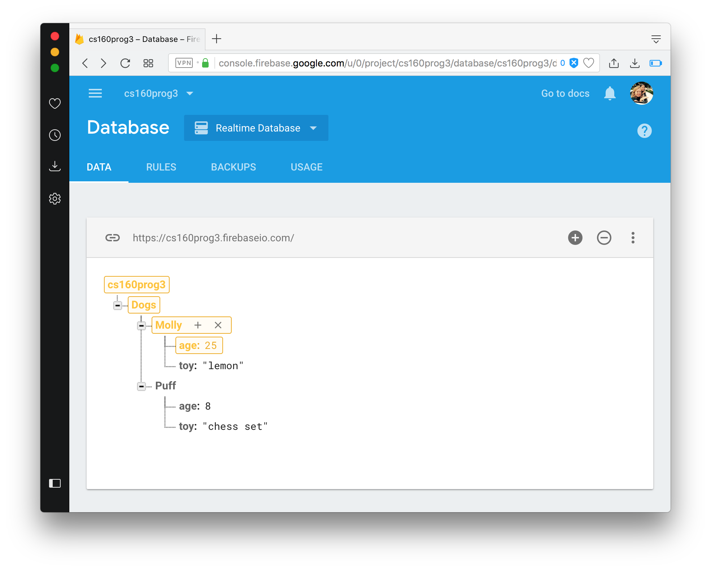

## Firebase Database Setup
This guide goes over setting up a your project, and how to read and write to it. To set up a Firebase console, you’ll need a Google account. You can use any google account for this.

### References 
- https://firebase.google.com/docs/android/setup
- https://firebase.google.com/docs/database/android/read-and-write

### Getting started 
If you haven’t already, create a new Android Studio project as you would normally. 

## Setting up the Realtime Database with an existing Android Studio Project
### Part 1: Connect your app to Firebase

1. In Android Studio, open the Firebase Console from the Tools menu: **Tools > Firebase** You should see a list of Firebase features. For this assignment, we’ll just be using the Realtime Database to store data shared among users.
2. Select **Realtime Database** from the list, and then click **Save and Retrieve Data**

3. Select **Connect Your App to Firebase**
4. If prompted, sign in to the account you want to use with Firebase, select **Create a new Firebase Project** and then **Connect to Firebase**.

After this step, you should see a project with the name your provided here:  https://console.firebase.google.com/

### Part 2: Add the Realtime Database to your App
1. Back in Android Studio, select **Add the Realtime Database to your app**. 

Build your app, and make sure there aren't any errors. 

### Part 3: Configure Firebase Database Rules
Firebase allows you to set permissions for who can read and write to your database. By default, this is set to private (only authenticated users can read and write to the database). Set read and write to public, so that you are able to read and write your app without Authentication implemented.

1. Open up your project via the online Firebase Console: https://console.firebase.google.com/
2. Select **Database** > **RealtimeDatabase** 


3. Open the **Rules** tab, and set both read and write permissions to public:
      
```json
{
    "rules": {
      ".read": true,
      ".write": true
    }
}
```

### Part 4: Write to your Database
In the firebase database, data is written to **references** using the `setValue` function. Here's an example of writing data to your database. 
     
```java
// entry point to access your Firebase database
FirebaseDatabase database = FirebaseDatabase.getInstance();

DatabaseReference dogsRef = database.getReference("Dogs");  // ~/Dogs

// use the `child` method to nest data
DatabaseReference molly = dogsRef.child("Molly");           // ~/Dogs/Molly/
molly.child("age").setValue(13);                            // ~/Dogs/Molly/age = 13
molly.child("toy").setValue("lemon");                       // ~/Dogs/Molly/toy = lemon
```

1. To test that your database is working, try writing to your database in your `onCreate` method.
2. Run your app, and check that your database contains the data you provided. Below is the output of the code posted above, with one extra dog.



3. You aren't just limited to strings and ints! Check out other writeable types here: https://firebase.google.com/docs/database/admin/save-data.

### Part 5: Read from your Database every time it is updated

Using ValueEventListeners, you can receive updates whenever your database is written to (perfect for a chat app or message board). Here is an example of adding a value event listener within an Android Studio Activity.   

```java
@Override
protected void onCreate(Bundle savedInstanceState){
    super.onCreate(savedInstanceState);

    // get the reference you want to watch 
    FirebaseDatabase db = FirebaseDatabase.getInstance();
    DatabaseReference dogsRef = db.getReference("Dogs");
    DatabaseReference someRef = dogsRef.child("Molly");

    // create a new value event listener
    ValueEventListener myDataListener = new ValueEventListener() {
         @Override
         public void onDataChange(DataSnapshot dataSnapshot) {
              // Set a breakpoint in this method and run in debug mode!!
              // this will be called each time `someRef` or one of its children is modified
              HashMap<String, String> mollyHashMap = (HashMap<String, String>) dataSnapshot.getValue();
         }
         @Override
         public void onCancelled(DatabaseError databaseError) {
              Log.d("0", "cancelled");
         }
    };
    // try changing `someRef` here
    someRef.addValueEventListener(myDataListener);
}
```

#### ValueEventListener
Like *OnClickListeners*, *ValueEventListeners* continuously "listen" for a certain event. While *OnClickListeners* recieve button click events (with `onClick` as the callback), *ValueEventListeners* receive events whenever the data in your database changes (with `onDataChange()` as the callback).

#### onDataChange()
`onDataChange(DataSnapshot: dataSnapshot)` - called whenever the ValueEventListener is attached to a reference (when `addValueEventListener`is called), or whenever the data of the reference or one of its children changes.
- `onDataChange` provides a **DataSnapshot**, which holds the data just read from your database. You can use `child()`to traverse the snapshot and `getValue()` to unwrap the data. 

### Try it yourself!
1. Add the code snippet above to your Android Activity
2. Add this database tree to your database using Android or using the online console (you can manually type it in, or upload as a json file).

```json
{
 "Dogs" : {
   "Molly" : {
     "age" : 13,
     "toy" : "lemon"
   },
   "Puff" : {
     "age" : 8,
     "toy" : "chess set"
   }
 }
}
```  

3. Run your app in debug mode, with a breakpoint in `onDataChange`. Change the value of `someRef` via your online console (in this code, that means modifying one of the "Molly" child nodes):



4. After changing the value of one of your references, you should see your updated value in your the new `dataSnapshot`


